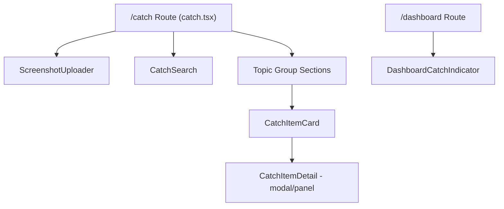

# Design Document: Screenshot Capture ("Catch")

## Overview

Catch is Sylo's screenshot inbox — a general life-organization layer where students dump messy screenshots and Sylo automatically reads, categorizes by topic, and files them. It extends Sylo's existing "what matters → what to do next" pipeline one layer earlier: turning "everything you screenshotted and forgot about" into "pieces sorted into your plan."

The feature follows the same architectural patterns already established in the app:
- **Server functions** via `createServerFn` (like `extractOpportunity.functions.ts` and `parseResume.functions.ts`)
- **Client-side state** via React Context + localStorage (like `WayfindProvider`/`useWayfind()`)
- **Claude API** via the shared `createAnthropicClient` helper using `claude-haiku-4-5-20251001`
- **Zod** for input/output schema validation
- **Workspace layout** with the `NAV` array for navigation

The core data flow is: **Image upload → client-side thumbnail generation → base64 encoding → server function → Claude vision API → structured CatchItem → localStorage persistence**.

---

## Architecture

```mermaid
graph TD
    subgraph Client ["Client (Browser)"]
        A[Screenshot Uploader] -->|file/paste/drag| B[Client Validation]
        B -->|valid image| C[Canvas Thumbnail Gen]
        C --> D[Base64 Encode Full Image]
        D -->|{imageBase64, mediaType, filename}| E[Server Function Call]
        E -->|CatchItemMetadata| F[Catch Store]
        F -->|persist| G[localStorage]
        F -->|read| H[Catch Page UI]
        F -->|read| I[Dashboard Indicator]
        H -->|addCustomStep| J[Wayfind Store]
    end

    subgraph Server ["Server (TanStack Start)"]
        E --> K[extractCatchItem]
        K -->|vision request| L[Claude Haiku Vision]
        L -->|structured JSON| K
    end
```

### Key Architectural Decisions

1. **Single vision call**: One Claude API call per image handles OCR, categorization, topic assignment, and opportunity detection. This minimizes latency and cost compared to chaining multiple calls.

2. **Client-side thumbnails**: Canvas-based resize to ~200px width at quality 0.6 before storing in localStorage. The full-resolution image is only sent to the server once and never persisted client-side (localStorage size constraints).

3. **Separate store**: `CatchProvider`/`useCatch()` lives in its own file rather than extending `WayfindProvider`. This keeps concerns isolated — Catch state doesn't bloat the wayfind persistence key and can evolve independently.

4. **Computed topic groups**: Topics are derived at render time from the `CatchItem.topic` field via a simple `reduce()`. No separate topics collection needed — this keeps the store flat and avoids sync issues.

5. **Bridge pattern for roadmap integration**: The Catch page calls `addCustomStep` from `useWayfind()` to create the roadmap step, then updates the CatchItem's `linkedStepId` via `useCatch()`. Two stores, one user action.

---

## Components and Interfaces

### Component Hierarchy



### Component Specifications

#### `ScreenshotUploader` (`src/components/screenshot-uploader.tsx`)

**Props:**
```typescript
interface ScreenshotUploaderProps {
  onItemProcessed: (item: CatchItem) => void;
  disabled?: boolean;
}
```

**Responsibilities:**
- Drag-and-drop zone with visual feedback
- File picker (multi-select enabled)
- Clipboard paste handler (`Cmd+V` / `Ctrl+V`)
- Per-image validation (format: PNG/JPEG/WebP, size: ≤8MB)
- Per-image progress indicator during processing
- Batch handling: invalid files show individual errors, valid files continue processing
- Calls `extractCatchItem` server function for each valid image
- Generates thumbnail via canvas before passing to store

**State:** Internal state tracks per-file upload status (`idle | processing | success | error`).

#### `CatchItemCard` (`src/components/catch-item-card.tsx`)

**Props:**
```typescript
interface CatchItemCardProps {
  item: CatchItem;
  onSelect: (id: string) => void;
  onAddToRoadmap?: (item: CatchItem) => void;
}
```

**Responsibilities:**
- Display thumbnail, title, tags, and deadline indicator
- Show opportunity badge when `isOpportunityLike === true`
- Show "Add to roadmap" button when opportunity-like and not yet linked
- Show "Added to roadmap" label when `linkedStepId` is set
- Use existing `DeadlinePill` component for deadline rendering

#### `CatchItemDetail` (`src/components/catch-item-detail.tsx`)

**Props:**
```typescript
interface CatchItemDetailProps {
  item: CatchItem;
  onClose: () => void;
  onUpdate: (id: string, patch: Partial<CatchItem>) => void;
  onDelete: (id: string) => void;
  onAddToRoadmap: (item: CatchItem) => void;
}
```

**Responsibilities:**
- Full item view with editable fields (title, tags, topic, detectedDate)
- Image thumbnail display
- Extracted text display (read-only)
- Delete action with confirmation
- Download thumbnail action
- "Add to roadmap" button when applicable

#### `CatchSearch` (`src/components/catch-search.tsx`)

**Props:**
```typescript
interface CatchSearchProps {
  items: CatchItem[];
  onResultSelect: (id: string) => void;
}
```

**Responsibilities:**
- Case-insensitive search across `extractedText`, `title`, and `tags`
- Inline results display (no separate route)
- Show title, topic, tags, and text snippet for each match
- Empty state message when no results
- Debounced input (150ms) for responsive filtering

#### `DashboardCatchIndicator` (`src/components/dashboard-catch-indicator.tsx`)

**Props:**
```typescript
interface DashboardCatchIndicatorProps {
  count: number;
  onDismiss: () => void;
}
```

**Responsibilities:**
- Single-line dismissible surface showing count of unlinked opportunity-like items
- Link to `/catch`
- Hidden when count is 0
- Dismissal persists for current session only (React state, not localStorage)

---

## Data Models

### CatchItem

```typescript
export type CatchItem = {
  /** Unique identifier (nanoid or timestamp-based). */
  id: string;
  /** Short AI-generated title summarizing the screenshot content. */
  title: string;
  /** Full OCR'd text extracted from the image. */
  extractedText: string;
  /** Open-ended topic label assigned by Claude (e.g. "Financial Aid", "Housing"). */
  topic: string;
  /** 2-4 descriptive tags. */
  tags: string[];
  /** Detected date from content in YYYY-MM-DD format, or undefined if none found. */
  detectedDate?: string;
  /** Whether the content represents a potential opportunity. */
  isOpportunityLike: boolean;
  /** Full opportunity details when isOpportunityLike is true. */
  opportunityDetails?: OpportunityDetails;
  /** ID of the roadmap custom step this item was linked to. */
  linkedStepId?: string;
  /** ISO timestamp of when this item was created. */
  createdAt: string;
  /** Compressed base64 thumbnail (canvas-resized, ~200px width, quality 0.6). */
  imageThumbnailBase64: string;
};
```

### OpportunityDetails

Reuses the same shape as `ProgramDetailsSchema` from `extractOpportunity.functions.ts`:

```typescript
export type OpportunityDetails = {
  name: string;
  deadline: string;
  requirements: string[];
  description: string;
  category: "Research" | "Internship" | "Fellowship" | "Club" | "Funding" | "Advising" | "Course";
  timeframe: string;
  contact: string;
};
```

### CatchState (Store Shape)

```typescript
type CatchState = {
  items: CatchItem[];
  hydrated: boolean;
  addItem: (item: CatchItem) => void;
  updateItem: (id: string, patch: Partial<Omit<CatchItem, "id" | "createdAt">>) => void;
  deleteItem: (id: string) => void;
  linkToRoadmap: (itemId: string, stepId: string) => void;
};
```

### Extraction Server Function Input/Output

```typescript
// Input
const ExtractCatchItemInput = z.object({
  imageBase64: z.string().min(1),
  mediaType: z.enum(["image/png", "image/jpeg", "image/webp"]),
  filename: z.string().min(1),
});

// Output (success)
type CatchItemMetadata = {
  title: string;
  extractedText: string;
  topic: string;
  tags: string[];
  detectedDate?: string;
  isOpportunityLike: boolean;
  opportunityDetails?: OpportunityDetails;
};

// Output (error)
type CatchExtractionError = { error: string };

// Combined
type ExtractCatchItemResult = CatchItemMetadata | CatchExtractionError;
```

### localStorage Schema

```
Key: "catch:state:v1"
Value: JSON.stringify({ items: CatchItem[] })
```

---

## Correctness Properties

*A property is a characteristic or behavior that should hold true across all valid executions of a system — essentially, a formal statement about what the system should do. Properties serve as the bridge between human-readable specifications and machine-verifiable correctness guarantees.*

### Acceptance Criteria Testing Prework

**Requirement 1: Image Upload and Validation**

1.1 THE Screenshot_Uploader SHALL accept images in PNG, JPEG, and WebP formats, rejecting all other file types with an error message.
  Thoughts: This is input validation — for any file type string, the validator should accept only the three allowed types and reject everything else. We can generate random file extensions and verify the accept/reject decision.
  Classification: PROPERTY
  Test Strategy: Generate random file extensions, verify only png/jpeg/webp are accepted.

1.2 THE Screenshot_Uploader SHALL reject any single image file larger than 8 MB.
  Thoughts: This is a boundary condition on file size. We can generate random file sizes and verify rejection above 8MB.
  Classification: PROPERTY
  Test Strategy: Generate random file sizes, verify rejection threshold at 8MB.

1.6 IF a file in a batch upload is invalid, THEN THE Screenshot_Uploader SHALL reject only that file while continuing to process all valid files.
  Thoughts: For any batch containing a mix of valid and invalid files, the valid files should all be processed and the invalid ones rejected independently.
  Classification: PROPERTY
  Test Strategy: Generate random batches with mixed valid/invalid files, verify valid ones are processed and invalid ones rejected independently.

**Requirement 2: Vision-Based Extraction**

2.2 THE Extraction_Service SHALL extract title, extractedText, topic, tags, and detectedDate from each image.
  Thoughts: This tests that the Claude API call and JSON parsing produce a complete structured output. Since the output depends on Claude's response, this is best tested with mocked API responses. We can generate random valid API responses and verify our parsing extracts all required fields.
  Classification: PROPERTY
  Test Strategy: Generate random valid Claude response shapes, verify parsing produces all required fields.

2.3 THE Extraction_Service SHALL determine isOpportunityLike and, if true, return ProgramDetailsSchema fields.
  Thoughts: This tests a conditional requirement — when isOpportunityLike is true, additional fields must be present. We can generate random extraction results and verify the invariant.
  Classification: PROPERTY
  Test Strategy: Generate random extraction results, verify that when isOpportunityLike is true, opportunityDetails is non-null and conforms to schema.

2.5 IF the Claude API returns an error or times out, THEN THE Extraction_Service SHALL return a structured error object.
  Thoughts: This tests error handling. We can mock various failure modes and verify we always get a structured error, never a thrown exception.
  Classification: PROPERTY
  Test Strategy: Generate random error types (timeout, network error, invalid JSON), verify all produce structured error objects without throwing.

**Requirement 3: Client-Side Persistence**

3.1 THE Catch_Store SHALL persist all CatchItem metadata in localStorage.
  Thoughts: This is a round-trip property — add an item, then read from localStorage, the item should be there.
  Classification: PROPERTY
  Test Strategy: Generate random CatchItems, add to store, verify localStorage contains the item (round-trip).

3.3 WHEN a Catch_Item is saved, THE Catch_Store SHALL assign a unique identifier and a createdAt timestamp.
  Thoughts: For any sequence of added items, all IDs must be unique and all createdAt timestamps must be valid ISO strings.
  Classification: PROPERTY
  Test Strategy: Generate random sequences of items, verify all IDs are unique and all createdAt values are valid ISO timestamps.

3.5 WHEN the student opens the app, THE Catch_Store SHALL hydrate state from localStorage without any network request.
  Thoughts: This is a round-trip: serialize to localStorage, then hydrate — the resulting state should match.
  Classification: PROPERTY
  Test Strategy: Generate random CatchItem arrays, serialize, hydrate, verify equality.

**Requirement 4: Topic Organization**

4.1 WHEN the Extraction_Service returns a topic label, THE Catch_Store SHALL file the item under that topic.
  Thoughts: For any item with a topic, grouping the items by topic should include that item under its topic.
  Classification: PROPERTY
  Test Strategy: Generate random items with topics, group by topic, verify each item appears under its assigned topic.

4.4 WHEN a student manually reassigns an item to a different topic, THE Catch_Store SHALL update that item's topic field.
  Thoughts: For any item and any new topic string, updating the topic should result in the item being filed under the new topic.
  Classification: PROPERTY
  Test Strategy: Generate random items and new topic strings, apply update, verify item moves to new topic group.

**Requirement 5: Deadline Surfacing**

5.2 WHEN a detectedDate is within 7 days from today, THE Catch_Page SHALL highlight it with an urgent indicator.
  Thoughts: For any date, we can determine if it's within 7 days and verify the correct urgency classification.
  Classification: PROPERTY
  Test Strategy: Generate random dates relative to today, verify urgency classification is correct (urgent if ≤7 days, normal if >7 days, passed if in the past).

**Requirement 6: Search**

6.1 WHEN a student enters a search query, THE Search function SHALL perform a case-insensitive match against extractedText, title, and tags.
  Thoughts: For any set of items and any query, all returned results must contain the query in at least one of the searchable fields (case-insensitive).
  Classification: PROPERTY
  Test Strategy: Generate random items and queries, verify all results contain the query substring in at least one searchable field.

6.2 THE Search function SHALL return results within 200ms for up to 200 items.
  Thoughts: This is a performance requirement. Best tested as a benchmark, not a property.
  Classification: SMOKE
  Test Strategy: Benchmark with 200 items, verify under 200ms.

**Requirement 7: Single Item View**

7.3 WHEN a student edits title, tags, or topic, THE Catch_Store SHALL persist the changes immediately.
  Thoughts: This is another round-trip — edit a field, read from store, verify the change persisted.
  Classification: PROPERTY
  Test Strategy: Generate random edits (title/tags/topic), apply to store, verify persistence matches.

**Requirement 8: Roadmap Integration**

8.3 WHEN a custom step is created from a CatchItem, THE Catch_Store SHALL set linkedStepId on that item.
  Thoughts: For any opportunity-like item, after linking, the linkedStepId should be set and non-empty.
  Classification: PROPERTY
  Test Strategy: Generate random opportunity-like items, simulate linking, verify linkedStepId is set.

**Requirement 9: Dashboard Tie-In**

9.2 THE Dashboard_Indicator SHALL display the count of items where isOpportunityLike is true and linkedStepId is not set.
  Thoughts: For any set of items, the count should equal the number of items where isOpportunityLike && !linkedStepId.
  Classification: PROPERTY
  Test Strategy: Generate random sets of items with varying isOpportunityLike and linkedStepId values, verify count matches filter.

9.5 WHEN the count is zero, THE Dashboard_Indicator SHALL not be displayed.
  Thoughts: Edge case of 9.2 — when the count is 0, the component should not render.
  Classification: EDGE_CASE
  Test Strategy: Covered by Property for 9.2 (count=0 is a natural generator output).

**Requirement 10: Navigation**

10.1-10.4 Navigation and layout requirements.
  Thoughts: These are integration/UI structure requirements — verifying the NAV array has the right entry, the route renders, etc. Not suitable for PBT.
  Classification: EXAMPLE
  Test Strategy: Example-based tests verifying route registration and NAV entry presence.

---

### Consolidation Notes

Reviewing all identified properties for redundancy:

1. **Properties 3.1 and 3.5** (localStorage round-trip and hydration round-trip) — these are closely related but test different directions: 3.1 tests write→read, 3.5 tests serialize→hydrate. They can be combined into a single round-trip property.
2. **Properties 1.1 and 1.2** (format validation and size validation) — these test different validation axes and can be combined into a single "file validation" property.
3. **Properties 4.1 and 4.4** (topic filing and topic reassignment) — these both test that an item's topic field determines its group membership. They can be combined.
4. **Property 9.2 and 9.5** — 9.5 is an edge case subsumed by 9.2.

After consolidation:

---

### Property 1: File Validation Correctness

*For any* file with a given extension and size, the validation function SHALL accept it if and only if the extension is one of `.png`, `.jpeg`, `.jpg`, or `.webp` AND the file size is ≤ 8MB. All other files SHALL be rejected.

**Validates: Requirements 1.1, 1.2**

### Property 2: Batch Isolation

*For any* batch of files containing a mix of valid and invalid files, the upload processor SHALL process all valid files to completion and reject all invalid files independently, such that the number of successfully processed items equals the number of valid files in the input batch.

**Validates: Requirements 1.6**

### Property 3: Extraction Schema Completeness

*For any* valid Claude vision API response (mocked), the parsing function SHALL produce a result containing all required fields (title, extractedText, topic, tags) and, when isOpportunityLike is true, SHALL additionally produce a valid OpportunityDetails object conforming to ProgramDetailsSchema.

**Validates: Requirements 2.2, 2.3**

### Property 4: Extraction Error Containment

*For any* API failure mode (timeout, network error, malformed response, invalid JSON), the extraction service SHALL return a structured error object with an `error` string field and SHALL NOT throw an unhandled exception.

**Validates: Requirements 2.5**

### Property 5: Store Persistence Round-Trip

*For any* sequence of CatchItem additions, the items written to localStorage via the Catch_Store SHALL be recoverable on hydration with identical field values, unique IDs, and valid ISO createdAt timestamps.

**Validates: Requirements 3.1, 3.3, 3.5**

### Property 6: Topic Grouping Invariant

*For any* set of CatchItems, each item SHALL appear in exactly the topic group matching its current `topic` field value. When an item's topic is updated, it SHALL move to the new topic group and no longer appear in the previous one.

**Validates: Requirements 4.1, 4.4**

### Property 7: Deadline Classification

*For any* date value relative to today, the deadline classifier SHALL categorize it as "urgent" (≤7 days in the future), "normal" (>7 days in the future), or "passed" (in the past), and the classification SHALL be deterministic for the same input date and reference date.

**Validates: Requirements 5.2, 5.3**

### Property 8: Search Completeness and Soundness

*For any* set of CatchItems and any search query string, every returned result SHALL contain the query as a case-insensitive substring in at least one of: `title`, `extractedText`, or any element of `tags`. Conversely, no item matching the query in any of those fields SHALL be excluded from results.

**Validates: Requirements 6.1**

### Property 9: Edit Persistence

*For any* CatchItem and any valid partial update to its title, tags, or topic, applying the update via the store's `updateItem` method SHALL result in the stored item reflecting the new values on the next read.

**Validates: Requirements 7.3**

### Property 10: Roadmap Linking Invariant

*For any* CatchItem where `isOpportunityLike` is true, after calling `linkToRoadmap(itemId, stepId)`, the item's `linkedStepId` SHALL equal the provided `stepId`, and the item SHALL no longer be counted in the unlinked opportunity count.

**Validates: Requirements 8.3, 9.2**

---

## Error Handling

### Upload Errors

| Scenario | Handling |
|----------|----------|
| Invalid file type | Immediate client-side rejection with message: "Please upload a PNG, JPEG, or WebP image." |
| File too large (>8MB) | Immediate client-side rejection with message: "Image must be under 8 MB." |
| FileReader failure | Show error on the specific file card: "Failed to read file. Please try again." |
| Batch with mixed validity | Reject invalid files individually; continue processing valid files in parallel |

### Extraction Errors

| Scenario | Handling |
|----------|----------|
| No API key configured | Return `{ error: "Screenshot extraction isn't available without an API key." }` |
| Claude API timeout (10s) | Return `{ error: "Extraction took too long. Try again." }` |
| Claude API error (rate limit, server error) | Return `{ error: "Extraction failed. Try again in a moment." }` |
| Malformed Claude response (no valid JSON) | Return `{ error: "Couldn't extract details from that screenshot. Try a clearer image." }` |
| Zod parse failure on extracted JSON | Return `{ error: "Couldn't structure the extracted content. Try again." }` |

### Store Errors

| Scenario | Handling |
|----------|----------|
| localStorage full | Catch gracefully — log warning, items remain in memory but won't persist across refresh. Show subtle toast: "Storage full — oldest items may not persist." |
| Corrupted localStorage data | On hydration failure, start with empty state (don't crash). |
| Invalid item ID on update/delete | No-op (idempotent). |

### UI Error Boundaries

- Each `CatchItemCard` renders independently — one broken item doesn't crash the list
- The extraction error is shown per-file in the uploader, not as a page-level error
- Network errors during extraction show a retry option on the specific file

---

## Testing Strategy

### Property-Based Tests (fast-check)

The project will use [fast-check](https://github.com/dubzzz/fast-check) for property-based testing in TypeScript. Each property from the Correctness Properties section maps to one test with minimum 100 iterations.

**Test file:** `src/lib/__tests__/catch-store.property.test.ts`

Properties to implement:
- Property 1: File validation correctness — generate random extensions and file sizes
- Property 2: Batch isolation — generate random file arrays with mixed validity
- Property 5: Store persistence round-trip — generate random CatchItem arrays
- Property 6: Topic grouping invariant — generate random items, mutate topics
- Property 7: Deadline classification — generate random dates relative to today
- Property 8: Search completeness — generate random items and queries
- Property 9: Edit persistence — generate random items and partial updates
- Property 10: Roadmap linking — generate random opportunity-like items

**Test file:** `src/lib/__tests__/extractCatchItem.property.test.ts`

Properties to implement:
- Property 3: Extraction schema completeness — mock Claude responses
- Property 4: Error containment — mock various failure modes

**Configuration:**
- Minimum 100 iterations per property (`{ numRuns: 100 }`)
- Each test tagged with: `// Feature: screenshot-capture, Property N: <property text>`

### Unit Tests (example-based)

- Validate the `validateCatchImage` function with specific edge cases (0-byte file, exactly 8MB, uppercase extensions)
- Verify `CatchProvider` hydration from localStorage with known fixtures
- Verify `addCustomStep` is called correctly during roadmap linking
- Verify DashboardCatchIndicator visibility logic with count=0, count=1, dismissed state

### Integration Tests

- Full upload flow: select file → validation → thumbnail gen → server call → store update → UI render
- Topic reassignment via drag-and-drop
- "Add to roadmap" flow: click button → custom step created in wayfind store → linkedStepId set in catch store
- Navigation: verify `/catch` route renders within Workspace layout

### What is NOT Tested with PBT

- Claude vision API output quality (tested manually / via prompt engineering iteration)
- Canvas thumbnail rendering fidelity (visual check)
- Drag-and-drop UX interactions (integration test with specific examples)
- localStorage quota limits (environment-specific, tested manually)
